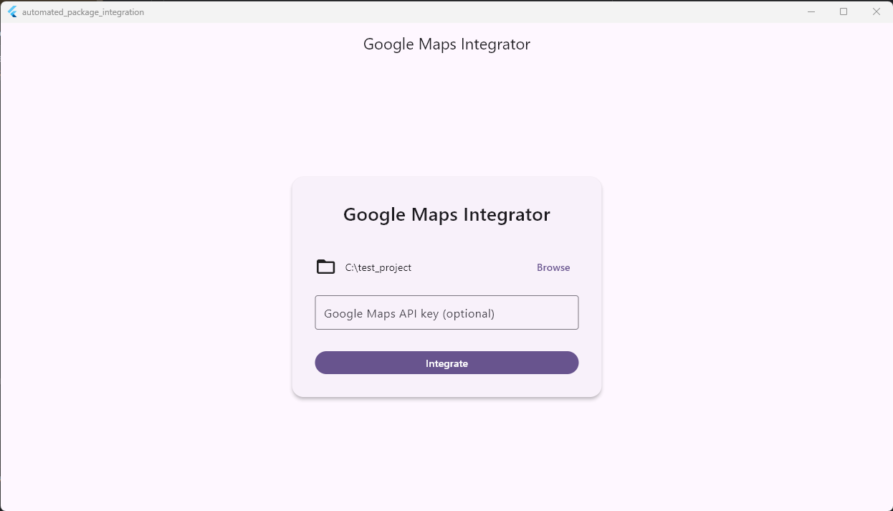
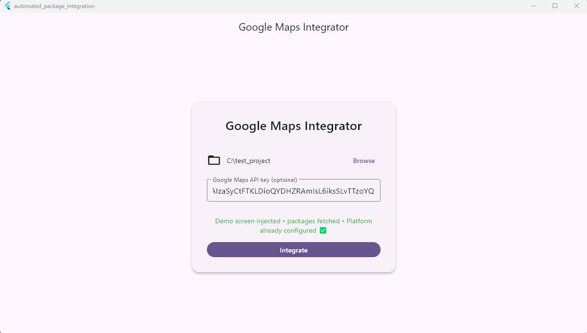
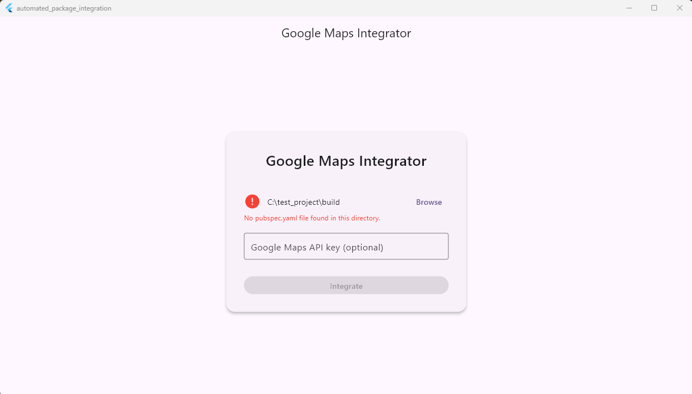

# automated_package_integration

# Google Maps Integrator

A Flutter desktop application that simplifies the integration of Google Maps into Flutter projects.


## 🚀 Features

- **One-Click Integration** of Google Maps Flutter package
- **Automatic Platform Configuration** for Android and iOS
- **Demo Screen Injection** with a working Google Maps implementation
- **API Key Management** across platform-specific configurations

## 📱 Screenshots

<div align="center">
  
  <br><br>
  
  <br><br>
   
</div>

## 🛠️ Installation

1. Clone this repository
   ```bash
   git clone https://github.com/yourusername/google-maps-integrator.git
   ```

2. Navigate to the project directory
   ```bash
   cd google-maps-integrator
   ```

3. Install dependencies
   ```bash
   flutter pub get
   ```

4. Run the application
   ```bash
   flutter run -d [your-desktop-platform]
   ```

## 💻 Usage

1. **Start the application** and you will see the main screen with options to select a Flutter project directory and enter your Google Maps API key.

2. **Select your Flutter project** by clicking on the "Select Flutter Project Directory" button.

3. **Enter your Google Maps API key** (optional). If provided, the application will configure your platforms to use this key.

4. **Click "Integrate"** and the application will:
    - Add the Google Maps Flutter package to your project
    - Configure platform-specific settings for Android and iOS
    - Inject a demo screen to showcase the implementation
    - Run `flutter pub get` to fetch the new dependencies

5. **Verify the integration** by checking your project files and running the app.

## 🏗️ Project Architecture

This project follows Clean Architecture principles with a clear separation of concerns:

```
lib/
├── features/
│   └── maps_integration/
│       ├── data/
│       │   └── maps_repository.dart
│       ├── domain/
│       │   ├── integration_result.dart
│       │   └── integration_service.dart
│       ├── presentation/
│       │   ├── controllers/
│       │   │   └── integration_controller.dart
│       │   ├── screens/
│       │   │   └── home_screen.dart
│       │   └── widgets/
│       │       ├── directory_picker_tile.dart
│       │       ├── integration_button.dart
│       │       └── integration_status_widget.dart
│       └── providers.dart
└── core/
    ├── services/
    │   ├── android_configurator.dart
    │   ├── ios_configurator.dart
    │   ├── pubspec_editor.dart
    │   ├── shell_utils.dart
    │   └── demo_injector.dart
    └── utils/
        └── validators.dart
```

### Key Components:

- **Presentation Layer**: Widgets, screens, and UI controllers
- **Domain Layer**: Business logic and service interfaces
- **Data Layer**: Data sources and repositories
- **Core**: Shared utilities and services

The application uses Riverpod for state management, providing a clean and testable architecture.


## 🤝 Contributing

1. Fork the Project
2. Create your Feature Branch (`git checkout -b feature/amazing-feature`)
3. Commit your Changes (`git commit -m 'Add some amazing feature'`)
4. Push to the Branch (`git push origin feature/amazing-feature`)
5. Open a Pull Request


## 📞 Contact

Your Name - [@Abdalrhman-Abuwarda](https://medium.com/@eng.abdalrhman33) - eng.abdalrhman33@example.com

Project Link: [https://github.com/Abdalrhman-Abuwarda/automated_package_integration](https://github.com/Abdalrhman-Abuwarda/automated_package_integration.git)

## 🙏 Acknowledgments

- [Flutter](https://flutter.dev/)
- [Google Maps Flutter](https://pub.dev/packages/google_maps_flutter)
- [Riverpod](https://riverpod.dev/)